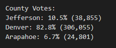
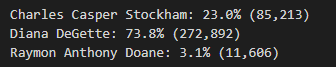

# Election_Analysis

## Project Overview 
A Colorado Board of Elections employee has given you the following tasks to complete the election audit of a recent local congressional election.

1. Calculate the total number of votes cast.
2. Get a complete list of candidates who received notes.
3. Calculate the total number of votes each candidate received.
4. Calculate the percentage of votes each candidate won.
5. Determine the winner of the election based on popular vote.

## Resources 
- Data Source: election_results.csv
- Software: Python 3.7.6, Visual Studio Code 

## Summary
The analysis of the election show that:
- There were 369,711 votes cast in the election.
- The candidates were:
    - Charles Casper Stockham
    - Diana DeGette
    - Raymon Anthony Doane
- The candidate results were:
    - Charles Casper Stockham received 23.0% of the vote and 85,213 number of votes.
    - Diana DeGette received 73.8% of the vote and 272,892 number of votes.
    - Raymon Anthony Doane received 3.1% of the vote and 11,606 number of votes.
- The winner of the election was:
    - Diana DeGette who received 73.8% of the vote and 272,892 number of votes.

## Challange Overview
Seth and Tom sought assistance in determining the winner of the Colorado elections once all of the votes had been collected to provide to the election commission and announce the winner. 
In the first portion of the data collection analysis, the Board had provided us the following tasks to focus on during the first round of the election audit:
    1.	Calculate the total number of votes cast.
    2.	Get a complete list of candidates who received notes.
    3.	Calculate the total number of votes each candidate received.
    4.	Calculate the percentage of votes each candidate won.
    5.	Determine the winner of the election based on popular vote.
    
Now having assisted Seth and Tom complete the election audit to determine the winner of Colorado’s election, the Board would like to investigate even further on the results collected and requested additional data before finalizing their audit. They are now interested in the following: 
    1.	The voter turnout for each county
    2.	The percentage of votes from each county out of the overall total count
    3.	The county with the highest voter turnout in this election

## Challenge Summary
The outcomes regarding county participation in this election are as followed: 
- Total amounts of votes casted in this congressional election:

    - There were 369,711 total votes cash in this election
- Breaking it down further per county, the number of votes and percentage of total votes were:

    - Jefferson County had 10.5% of total voter turnout and 38,855 number of votes.
    - Denver had 82.8% of total voter turnout and 306,055 number of votes.
    - Arapahoe County had 6.7% of total voter turnout and 24,801 number of votes.
   
- The largest county turnout was:
    - Denver had 82.8% of total voter turnout and 306,055 number of votes.
   
- Candidate results

    - Charles Casper Stockham received 23.0% of the vote and 85,213 number of votes.
    - Diana DeGette received 73.8% of the vote and 272,892 number of votes.
    - Raymon Anthony Doane received 3.1% of the vote and 11,606 number of votes.
    
- The winner of the Colorado election is:

    - Diana DeGette who received 73.8% of the vote and 272,892 number of votes.

## Election Audit Summary
Now for future elections, the election commission can look to utilize the script with a few modifications to not only continuing analyzing the winner and county voter turnout, but for other factors as well. One way in which this script can be used is what voter turnout count and percentage looks like for each candidate running based in each county. It would help demonstrate which county favored a candidate versus its counterparts. Likewise, another benefit the election commission that would come from using this script is obtaining further statistical data regarding central tendencies such as the mean from each county to observe the average amounts of voters were participating in each election for each county and even the candidates. It would add another perspective getting more granular on the data as to what the average was for a candidate in this county versus their competitor and compare side by side. Bringing it altogether with providing a greater and deeper analysis of the overall election results. 
